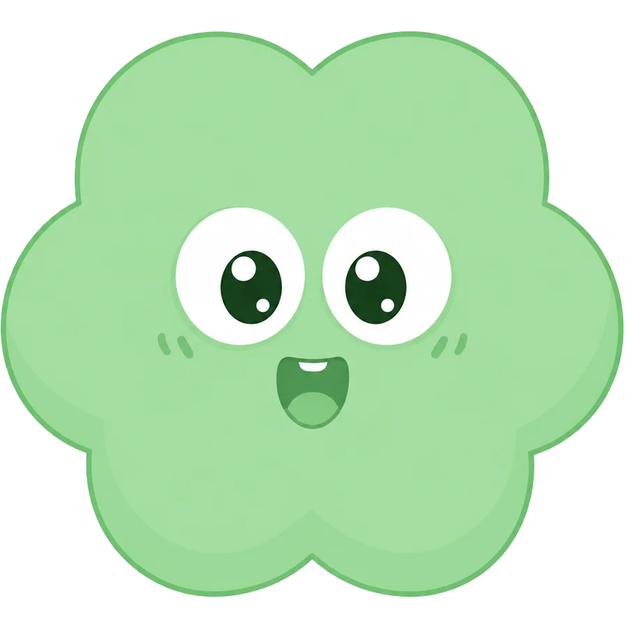
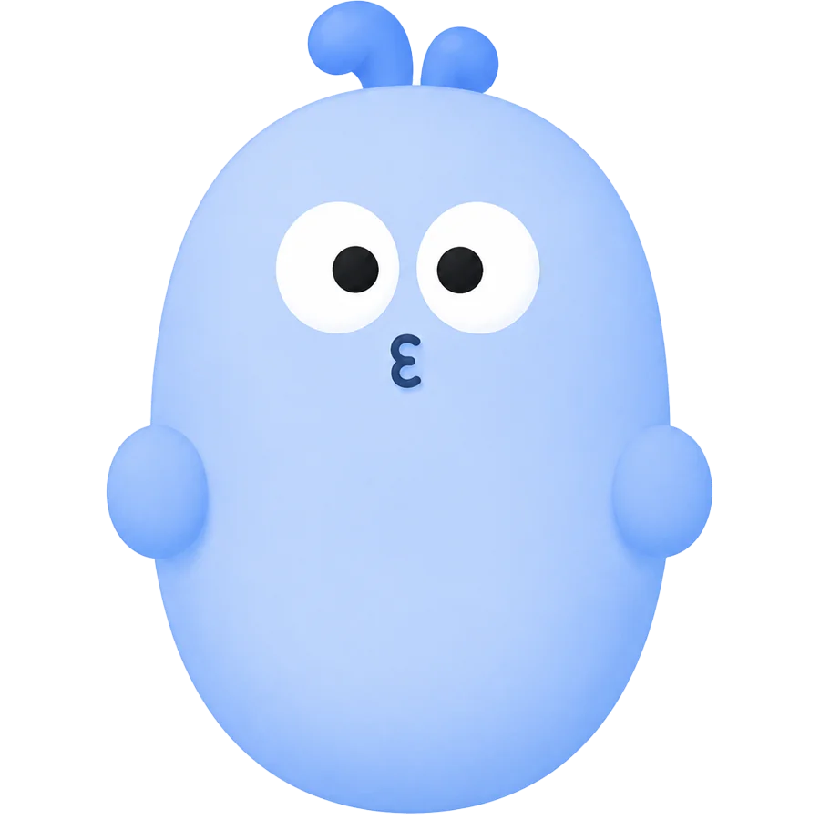
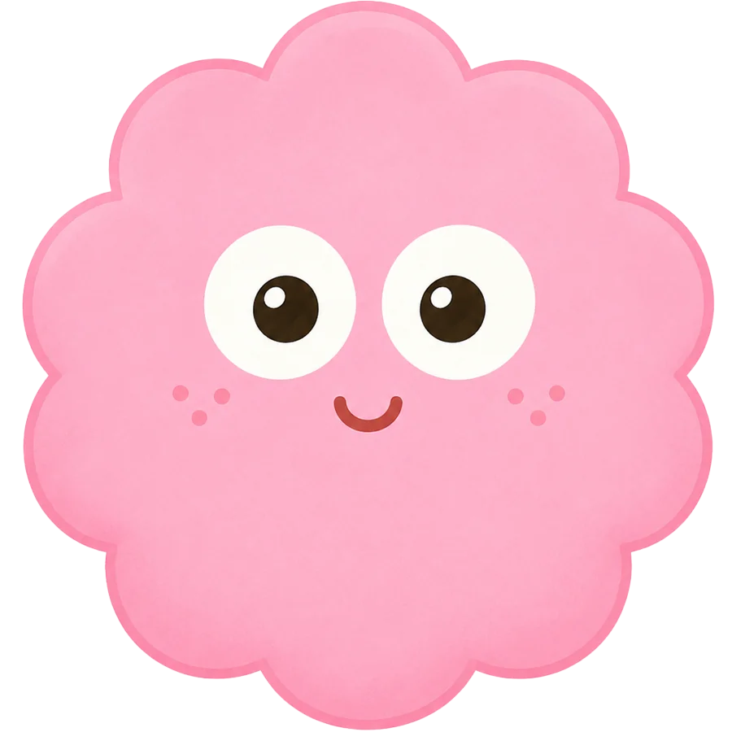
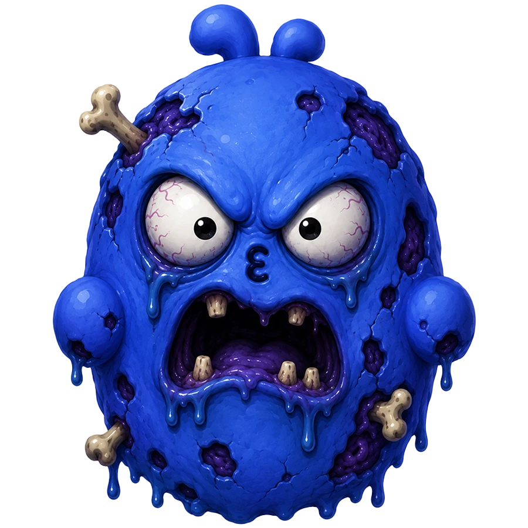
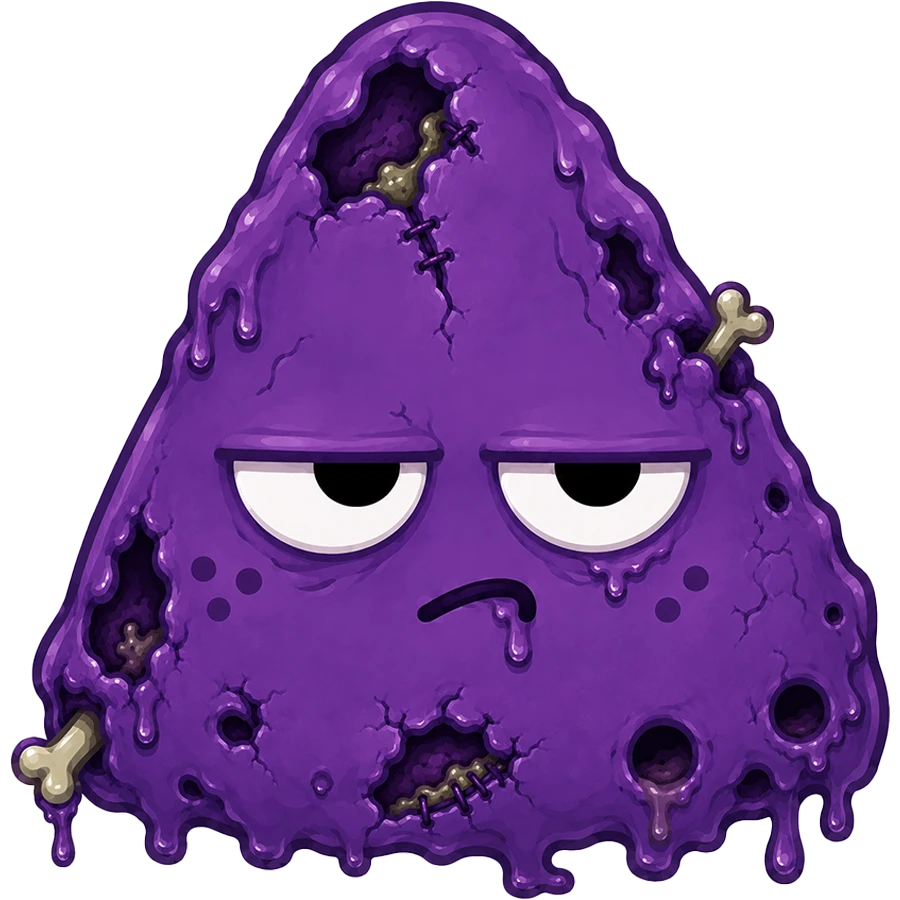
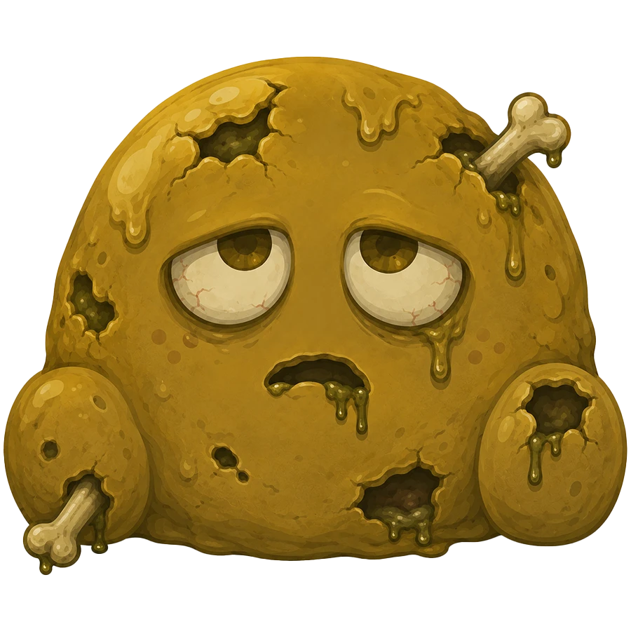
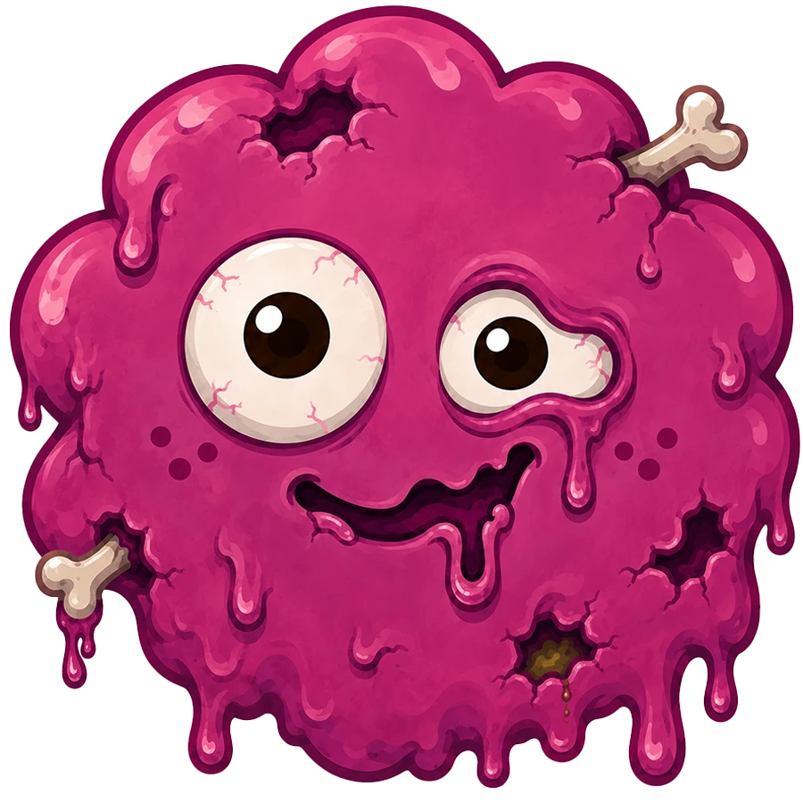

# 📚 Question Run · 刷题

一款基于 **Web** 的轻量刷题应用，专注计算机学科（操作系统 / 算法设计与分析）。支持选择 / 填空 / 简答 / 算法题，内置错题本、收藏、刷题 / 背题双模式、JSON 题库导入导出，移动端友好的 Duolingo 风格界面。

> 🎯 适合期末复习、考研刷题、刷题库自检。打开网页即用，无需后端。

如果你觉得有用，**求大家给点点 ⭐ Star**，你的支持是持续更新的最大动力！


---

## ✨ 功能特性

- 🎴 **多题型支持** — 选择、填空、算法填空、简答、算法设计题
- 📖 **题库管理** — 内置操作系统 9 章 + 综合复习 + 5 套课堂练习 + 算法题库，支持 JSON 导入自定义题库
- 🧠 **三种模式** — 刷题（计时 + 错题标记）/ 背题（直接看答案）/ 错题本
- 🎨 **亮 / 暗主题** — 跟随系统或手动切换
- 📱 **移动端适配** — 抽屉式汉堡菜单，触摸优化的按钮和动画
- 💾 **本地存储** — 进度自动保存到 localStorage，无需注册登录
- 🔍 **筛选搜索** — 按题型、状态（未刷 / 已刷 / 错题 / 收藏）、关键词筛选
- 🎉 **交互动画** — 答对彩带、答错抖动、连续答对 streak 提示
- ⌨️ **键盘快捷键** — QWER/1234 选答案，← → 切换题，Enter 确认，M 收藏
- ⏳ **考试倒计时** — 显示距考试剩余时间（点击可隐藏）
- 📊 **刷题排行榜** — 公开 API，查看做题排行（按匿名指纹去重）
- 📳 **震动反馈** — 安卓手机震动，交互更真实
- 🔥 **卷王标签** — 24:00 后刷题自动显示卷王标识

---

## 📱 效果展示

### 暗色模式

<div align="center">
  
  
</div>

### 亮色模式

<div align="center">
  
  
</div>

---

## 🚀 快速开始

### 1. 启动本地服务

```bash
# 克隆仓库
git clone https://github.com/Jayaway/Question-run.git
cd Question-run

# 用 Node.js 启动
node server.js
```

或者使用任何静态文件服务器：

```bash
# Python
python3 -m http.server 3000

# 或任意 HTTP server，指向项目根目录
```

打开浏览器访问 **http://localhost:3000**

### 2. 直接打开（部分功能受限）

`index.html` 也可以直接双击打开，但浏览器的 `localStorage` 在 `file://` 协议下也能用，只是部分浏览器会限制跨文件读取。建议还是用本地 HTTP server。

---

## 🗂 项目结构

```
Question-run/
├── index.html          # 主页面
├── admin.html          # 站长后台（数据查看）
├── app.js              # 核心逻辑
├── banks.js            # 内置题库（操作系统 9 章 + 综合复习 + 课堂练习）
├── data.js             # 算法设计与分析题库
├── server.js           # Node 静态服务 + 访问统计
├── styles.css          # 全部样式
├── 题库/                # 题库 JSON 源文件
│   ├── 操作系统-第一章-操作系统引论.json
│   ├── 操作系统-第二章-进程管理及同步.json
│   ├── ...
│   └── 操作系统-综合复习题库.json
├── assets/             # 图片素材
└── docs/               # 文档
    └── screenshots/    # README 截图
```

---

## 📝 题库格式

题库是标准 JSON 数组，每题结构如下：

```json
{
  "id": "os-ch1-001",
  "number": 1,
  "section": "基础概念",
  "type": "choice",
  "title": "基础概念 1",
  "prompt": "关于操作系统的本质，下列说法正确的是（ ）。",
  "options": [
    { "key": "A", "text": "操作系统位于应用程序之上" },
    { "key": "B", "text": "操作系统是控制和管理计算机硬件与软件资源的系统软件" },
    { "key": "C", "text": "操作系统只负责管理外存" },
    { "key": "D", "text": "操作系统是专门用于文字处理的应用软件" }
  ],
  "answer": "B",
  "analysis": "操作系统属于系统软件，核心作用是资源管理。"
}
```

- `type`：`choice` | `fill` | `code` | `short` | `design`
- `answer`：选择题用选项 key（如 `"B"`），填空题用 `;` 分隔的多空答案
- `analysis`：答案解析，可选

导入方式：左上角 → 工具 → 选择 JSON 文件。

---

## 🛠 技术栈

- **原生 JavaScript** — 无框架依赖，加载快、运行轻
- **CSS3** — 渐变、动画、Grid / Flexbox 布局
- **localStorage** — 进度持久化（防抖写入，避免阻塞主线程）
- **Node.js** — 静态服务 + 访问统计 + 排行榜 API（内存缓存 + 异步批量落盘）
- **Web Audio API** — 实时合成音效，无须加载音频文件
- **HTTP 缓存策略** — 图片永久缓存，CSS/JS 长期缓存，首屏秒开

无任何构建步骤、无包管理，下载即用。

---

## 📊 题目统计

| 类别 | 数量 |
|------|------|
| 操作系统 9 章 + 课堂练习 | 约 600 题 |
| 操作系统综合复习 | 34 题 |
| 算法设计与分析 | 100+ 题 |
| **合计** | **700+ 题** |

---

## 🌟 Star History

如果这个项目对你有帮助，**点个 ⭐ Star** 是对作者最大的鼓励！

[](https://star-history.com/#Jayaway/Question-run&Date)

---

## 🐛 报告问题

发现 Bug 或想提建议？欢迎开 Issue 反馈！

- 🐛 [报告 Bug](https://github.com/Jayaway/Question-run/issues/new?template=bug_report.md)
- ✨ [功能建议](https://github.com/Jayaway/Question-run/issues/new?template=feature_request.md)
- 📚 [贡献题库](https://github.com/Jayaway/Question-run/issues/new?template=question_bank.md)

---

## 🤝 贡献

欢迎 PR 新的题库、修复 bug、优化交互！

1. Fork 本仓库
2. 创建 feature 分支 (`git checkout -b feature/awesome`)
3. 提交更改 (`git commit -m 'Add some feature'`)
4. 推送到分支 (`git push origin feature/awesome`)
5. 打开 Pull Request

---

## 📜 License

MIT © [Jayaway](https://github.com/Jayaway)

---

## 👥 贡献者

感谢所有为这个项目付出的人！

<a href="https://github.com/Jayaway/Question-run/graphs/contributors">
  
</a>

> 🎉 成为第一个贡献者！提交 PR 后你的头像会自动出现在这里。

---

## 🎭 卡通形象家族

刷题不再孤单！项目内置了一支 **5 人小分队**，根据你最近 15 题的正确率自动切换出场角色，每个角色都有自己的性格和台词。  
更重要的是：**亮色版和暗色版各有一套独立的形象配色** —— 同一角色在不同主题下会换上不同的"皮肤"。

### 📸 项目截图速览

<div align="center">
  
  
</div>

<div align="center">
  
  
</div>

---

### 🌞 亮色版 · 5 位角色

> 整体画风偏暖、扁平、贴纸感，背景为亮色（白/浅黄），色调明亮活泼。

| 角色 | 形象 | 性格 | 适用场景 |
|---|---|---|---|
| **Gru 格鲁** |  | 严谨的王者，嘴角微沉 | 正确率 ≥ 85% |
| **Boobo 布布** |  | 阳光学长，温柔鼓励 | 正确率 60% – 85% |
| **Waiwai 歪歪** |  | 元气小学生，感叹号常驻 | 中段位的能量补给 |
| **Dodo 多多** |  | 圆滚滚的暖心萌物 | 起步阶段陪伴 |
| **Mimo 米莫** |  | 软糯学妹，细声安慰 | 正确率 < 60% |

### 🌙 暗色版 · 同一批角色 · 暗色皮肤

> 整体画风偏冷、夜光感，背景为深色（黑/深灰），保留角色识别度但换上更"酷"的色板。

| 角色 | 形象 | 性格（同角色·夜话版） | 适用场景 |
|---|---|---|---|
| **Gru 格鲁** |  | 毒舌版王者，冷笑怼人 | 正确率 ≥ 85% |
| **Boobo 布布** |  | 傲娇学长，嘴硬心软 | 正确率 60% – 85% |
| **Waiwai 歪歪** |  | 抓狂小学生，感叹号爆裂 | 中段位的反向鞭策 |
| **Dodo 多多** |  | 圆滚滚·夜行版陪练 | 起步阶段陪伴 |
| **Mimo 米莫** |  | 冷脸版软妹，毒舌但不伤人 | 正确率 < 60% |

> 💡 **小彩蛋**：同一个角色在亮 / 暗模式下说的台词完全不同。亮色模式是温柔鼓励，暗色模式是毒舌吐槽 —— 你可以靠切换主题来切换"陪练老师"的态度 😏

### 🎉 答对 / 答错反馈素材

每次答对会从三张庆祝图中随机抽一张，答错则是统一的"傻眼"表情：

| 答对 · Sunglasses | 答对 · Glow | 答对 · Celebrate | 答错 · Speechless |
|---|---|---|---|
|  |  |  |  |

---

### 🪄 它们是怎么出现的？（AI 生成提示词公开）

所有卡通形象均由 AI（基于 Midjourney / SDXL 风格的提示词）生成。  
**核心思路**：先确定角色的"物种 + 性格 + 配色"，再通过主提示词生成亮色版，叠加 negative prompt + 配色覆盖生成暗色版。

#### 🎨 通用风格基线（所有角色共用）

```
风格：flat 2D illustration, sticker style, chibi proportions, big head small body,
thick outlines, soft shading, single character, simple gradient background,
square 1:1 aspect ratio, 1024x1024, no text, no watermark
```

#### ☀️ 亮色版主提示词模板

```
A cute [species] mascot character named [name],
[color] palette with pastel highlights,
[personality keywords],
white/cream soft background, sticker style, vector-like clean lines,
Duolingo-style friendly look, full body visible, smiling pose
```

#### 🌙 暗色版主提示词模板

```
The same [species] mascot character named [name], nighttime version,
dark navy / charcoal background with neon rim light,
[same personality but cooler/more sarcastic],
muted saturation, cinematic noir mood, glowing eyes,
sticker style, full body visible, slight smirk or eye-roll pose
```

#### 🧩 5 个角色各自的具体提示词

<details>
<summary><b>🐉 Gru 格鲁（王者·绿）</b></summary>

**亮色版：**
```
A small green dragon mascot with tiny wings and a serious expression,
forest green (#58cc02) body with golden belly,
chibi style, confident arms-crossed pose,
white background, flat 2D sticker, Duolingo-style,
big round eyes, friendly but stern look
```
**暗色版：**
```
The same green dragon mascot in nighttime mode,
dark teal body with glowing neon green outline (#58cc02 glow),
smirking face, crossed arms, glowing yellow slit pupils,
charcoal background with subtle star particles,
cinematic sticker style, sarcastic smirk
```

</details>

<details>
<summary><b>🐻 Boobo 布布（暖男·蓝）</b></summary>

**亮色版：**
```
A round blue bear cub mascot with big sparkly eyes,
sky blue (#59b8ff) fur with white belly patch,
chibi style, gentle wave pose with open arms,
cream background, soft pastel highlights,
friendly smile, sticker style, full body visible
```
**暗色版：**
```
The same blue bear cub mascot at night,
muted indigo fur with cyan rim light,
half-lidded eyes, tiny pout, arms folded,
deep navy background, slight eye-roll,
sticker style, tsundere mood
```

</details>

<details>
<summary><b>🐤 Waiwai 歪歪（元气·黄）</b></summary>

**亮色版：**
```
A tiny yellow chick mascot with huge surprised eyes and an exclamation mark above head,
bright yellow (#ffbf3d) feathers with orange beak,
chibi style, jumping pose, wings spread wide,
light yellow background, energetic sticker,
very expressive shocked face
```
**暗色版：**
```
The same yellow chick mascot in panic mode at night,
mustard yellow feathers with red exclamation mark glowing,
wide panicked eyes, sweat drops flying,
dark background with motion lines,
hyperactive sticker style, anime shock
```

</details>

<details>
<summary><b>🐤 Dodo 多多（陪伴·橙）</b></summary>

**亮色版：**
```
A chubby orange dodo bird mascot with a big round belly,
warm orange (#ffbf3d) feathers with cream belly,
chibi style, waddling pose with one foot up,
soft beige background, cute round sticker,
sleepy gentle smile, hugging itself
```
**暗色版：**
```
The same orange dodo bird mascot at night,
dark amber feathers with soft glowing eyes,
sitting pose, half-asleep look,
deep brown background, candle-like warm glow,
sticker style, cozy sleepy mood
```

</details>

<details>
<summary><b>🐰 Mimo 米莫（治愈·粉）</b></summary>

**亮色版：**
```
A tiny pink rabbit mascot with floppy ears and big watery eyes,
pastel pink (#ff9fbd) fur with white paws,
chibi style, hugging knees pose,
pale pink background, kawaii sticker,
shy timid smile, very small body
```
**暗色版：**
```
The same pink rabbit mascot in nighttime mode,
dusty rose fur with cold magenta rim light,
flat deadpan stare, holding a tiny knife metaphorically,
charcoal background, soft smirk,
sticker style, slightly unsettling cute
```

</details>

#### 🛑 Negative Prompt（共用，避免 AI 翻车）

```
realistic, 3d render, photo, human face, scary, horror, gore,
multiple characters, text, watermark, signature,
blurry, low quality, deformed hands, extra fingers
```

#### 🔄 亮 / 暗版批量生成的工程化做法

```bash
# 伪代码：用 ComfyUI / SDXL WebUI 跑批量
for role in gru boobo waiwai dodo mimo; do
  # 1. 先跑亮色版
  python gen.py --prompt "$(cat prompts/${role}_light.txt)" \
                --out assets/${role}-front.webp
  
  # 2. 复用同一 seed，加 negative prompt + 配色覆盖跑暗色版
  python gen.py --prompt "$(cat prompts/${role}_dark.txt)" \
                --seed $(cat seeds/${role}.txt) \
                --out assets/${role}-dark.webp
done
```

> 🎯 保持 **同一 seed** 是亮 / 暗版"同一个角色"的关键 —— 形象轮廓一致，只换肤色和背景。

---

## 🙏 致谢

- 🎭 5 位卡通形象（Gru / Boobo / Waiwai / Dodo / Mimo）由 AI 生成，亮 / 暗双版本独立绘制
- 音效由 Web Audio API 实时合成
- 样式灵感来自 Duolingo

---

<p align="center">
  Made with ❤️ by <a href="https://github.com/Jayaway">Jayaway</a>
</p>

<p align="center">
  <b>⭐ 如果觉得有用，欢迎点 Star ！⭐</b>
</p>
