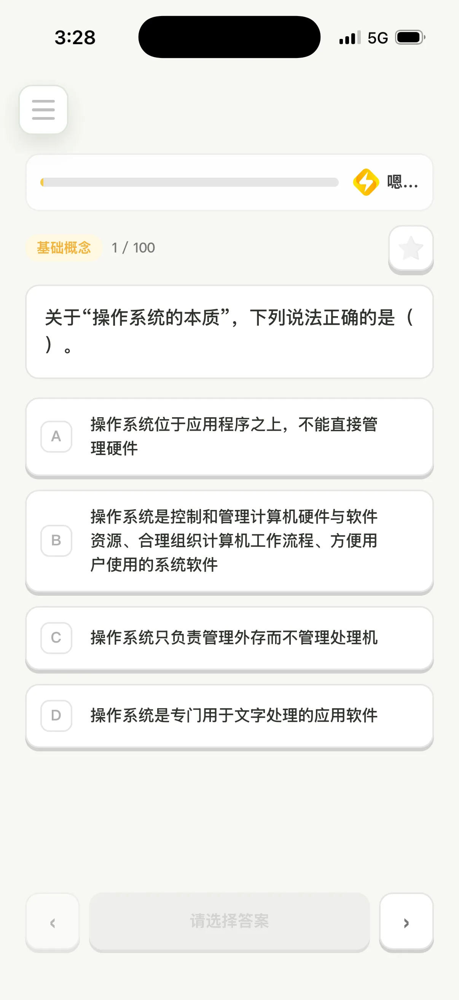
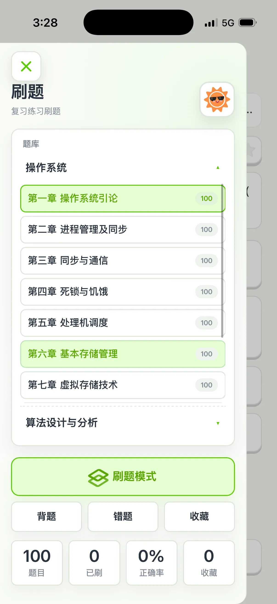
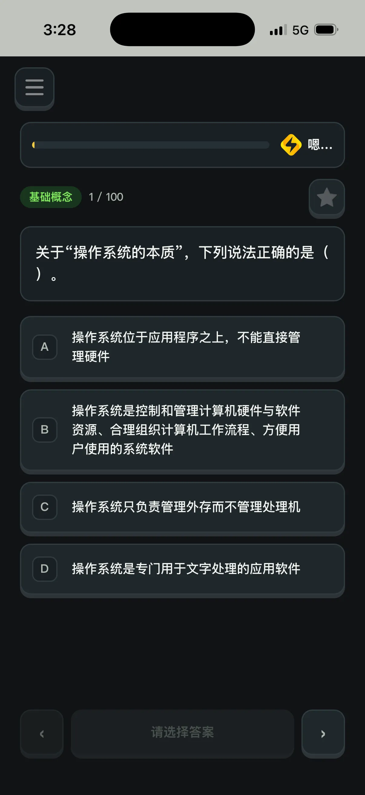
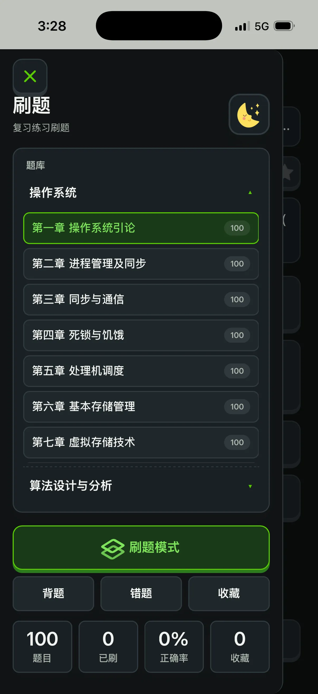

# 📚 Question Run · 刷题

一款基于 **Web** 的轻量刷题应用，专注计算机学科（操作系统 / 算法设计与分析）。支持选择 / 填空 / 简答 / 算法题，内置错题本、收藏、刷题 / 背题双模式、JSON 题库导入导出，移动端友好的 Duolingo 风格界面。

> 🎯 适合期末复习、考研刷题、刷题库自检。打开网页即用，无需后端。

如果你觉得有用，**求大家给点点 ⭐ Star**，你的支持是持续更新的最大动力！


---

## ✨ 功能特性

- 🎴 **多题型支持** — 选择、填空、算法填空、简答、算法设计题
- 📖 **题库管理** — 内置操作系统 9 章 + 综合复习 + 5 套课堂练习 + 算法题库，支持 JSON 导入自定义题库
- 🧠 **三种模式** — 刷题（计时 + 错题标记）/ 背题（直接看答案）/ 错题本
- 🎨 **亮 / 暗主题** — 跟随系统或手动切换
- 📱 **移动端适配** — 抽屉式汉堡菜单，触摸优化的按钮和动画
- 💾 **本地存储** — 进度自动保存到 localStorage，无需注册登录
- 🔍 **筛选搜索** — 按题型、状态（未刷 / 已刷 / 错题 / 收藏）、关键词筛选
- 🎉 **交互动画** — 答对彩带、答错抖动、连续答对 streak 提示
- ⌨️ **键盘快捷键** — QWER/1234 选答案，← → 切换题，Enter 确认，M 收藏
- ⏳ **考试倒计时** — 显示距考试剩余时间（点击可隐藏）
- 📊 **刷题排行榜** — 公开 API，查看做题排行（按匿名指纹去重）
- 📳 **震动反馈** — 安卓手机震动，交互更真实
- 🔥 **卷王标签** — 24:00 后刷题自动显示卷王标识

---

## 📱 效果展示

### 暗色模式

<div align="center">
  
  
</div>

### 亮色模式

<div align="center">
  
  
</div>

---

## 🚀 快速开始

### 1. 启动本地服务

```bash
# 克隆仓库
git clone https://github.com/Jayaway/Question-run.git
cd Question-run

# 用 Node.js 启动
node server.js
```

或者使用任何静态文件服务器：

```bash
# Python
python3 -m http.server 3000

# 或任意 HTTP server，指向项目根目录
```

打开浏览器访问 **http://localhost:3000**

### 2. 直接打开（部分功能受限）

`index.html` 也可以直接双击打开，但浏览器的 `localStorage` 在 `file://` 协议下也能用，只是部分浏览器会限制跨文件读取。建议还是用本地 HTTP server。

---

## 🗂 项目结构

```
Question-run/
├── index.html          # 主页面
├── admin.html          # 站长后台（数据查看）
├── app.js              # 核心逻辑
├── banks.js            # 内置题库（操作系统 9 章 + 综合复习 + 课堂练习）
├── data.js             # 算法设计与分析题库
├── server.js           # Node 静态服务 + 访问统计
├── styles.css          # 全部样式
├── 题库/                # 题库 JSON 源文件
│   ├── 操作系统-第一章-操作系统引论.json
│   ├── 操作系统-第二章-进程管理及同步.json
│   ├── ...
│   └── 操作系统-综合复习题库.json
├── assets/             # 图片素材
└── docs/               # 文档
    └── screenshots/    # README 截图
```

---

## 📝 题库格式

题库是标准 JSON 数组，每题结构如下：

```json
{
  "id": "os-ch1-001",
  "number": 1,
  "section": "基础概念",
  "type": "choice",
  "title": "基础概念 1",
  "prompt": "关于操作系统的本质，下列说法正确的是（ ）。",
  "options": [
    { "key": "A", "text": "操作系统位于应用程序之上" },
    { "key": "B", "text": "操作系统是控制和管理计算机硬件与软件资源的系统软件" },
    { "key": "C", "text": "操作系统只负责管理外存" },
    { "key": "D", "text": "操作系统是专门用于文字处理的应用软件" }
  ],
  "answer": "B",
  "analysis": "操作系统属于系统软件，核心作用是资源管理。"
}
```

- `type`：`choice` | `fill` | `code` | `short` | `design`
- `answer`：选择题用选项 key（如 `"B"`），填空题用 `;` 分隔的多空答案
- `analysis`：答案解析，可选

导入方式：左上角 → 工具 → 选择 JSON 文件。

---

## 🛠 技术栈

- **原生 JavaScript** — 无框架依赖，加载快、运行轻
- **CSS3** — 渐变、动画、Grid / Flexbox 布局
- **localStorage** — 进度持久化（防抖写入，避免阻塞主线程）
- **Node.js** — 静态服务 + 访问统计 + 排行榜 API（内存缓存 + 异步批量落盘）
- **Web Audio API** — 实时合成音效，无须加载音频文件
- **HTTP 缓存策略** — 图片永久缓存，CSS/JS 长期缓存，首屏秒开

无任何构建步骤、无包管理，下载即用。

---

## 📊 题目统计

| 类别 | 数量 |
|------|------|
| 操作系统 9 章 + 课堂练习 | 约 600 题 |
| 操作系统综合复习 | 34 题 |
| 算法设计与分析 | 100+ 题 |
| **合计** | **700+ 题** |

---

## 🌟 Star History

如果这个项目对你有帮助，**点个 ⭐ Star** 是对作者最大的鼓励！

[](https://star-history.com/#Jayaway/Question-run&Date)

---

## 🐛 报告问题

发现 Bug 或想提建议？欢迎开 Issue 反馈！

- 🐛 [报告 Bug](https://github.com/Jayaway/Question-run/issues/new?template=bug_report.md)
- ✨ [功能建议](https://github.com/Jayaway/Question-run/issues/new?template=feature_request.md)
- 📚 [贡献题库](https://github.com/Jayaway/Question-run/issues/new?template=question_bank.md)

---

## 🤝 贡献

欢迎 PR 新的题库、修复 bug、优化交互！

1. Fork 本仓库
2. 创建 feature 分支 (`git checkout -b feature/awesome`)
3. 提交更改 (`git commit -m 'Add some feature'`)
4. 推送到分支 (`git push origin feature/awesome`)
5. 打开 Pull Request

---

## 📜 License

MIT © [Jayaway](https://github.com/Jayaway)

---

## 👥 贡献者

感谢所有为这个项目付出的人！

<a href="https://github.com/Jayaway/Question-run/graphs/contributors">
  
</a>

> 🎉 成为第一个贡献者！提交 PR 后你的头像会自动出现在这里。

---

## 🙏 致谢

- 五个卡通形象分别是～ 我也忘了叫啥了，你们自己探索去吧。
- 音效由 Web Audio API 实时合成
- 样式灵感来自 Duolingo

---

<p align="center">
  Made with ❤️ by <a href="https://github.com/Jayaway">Jayaway</a>
</p>

<p align="center">
  <b>⭐ 如果觉得有用，欢迎点 Star ！⭐</b>
</p>
